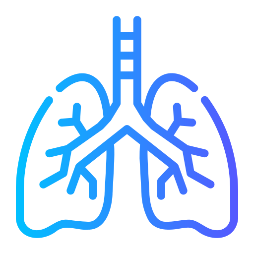

# LungIQ: Lung Disease Prediction  

<table>
<tr>
<td>

</td>
<td>
<b><i>LungIQ is an innovative web-based platform designed to analyze X-ray images and predict whether a person is suffering from pneumonia, COVID-19, or is in a normal condition. Leveraging the power of deep learning and CNN-based models, Luniq delivers fast, reliable, and accurate results to assist healthcare professionals and individuals in early detection and diagnosis of lung diseases.</b>
</td>
</tr>
</table>

## Features
- **📸 Image-Based Disease Prediction**:   
  Upload X-ray images of the lungs to receive accurate predictions about the presence of pneumonia, COVID-19, or a normal lung condition.

- **🤖 Advanced AI Technology**:   
  Utilizes a powerful convolutional neural network (CNN) model trained on large datasets to classify X-ray images with high precision.

- **⚡ Fast and Reliable Results**:   
  Get instant diagnostic results, helping in the early detection of potential lung diseases for prompt medical attention.

- **📚 Comprehensive Insights**:   
  Along with disease predictions, Luniq provides valuable insights about the diseases, including symptoms, progression, and treatment options.

## How To Use
### 1. Visit the LungIQ platform  
Capture a clear, high-quality X-ray image of the patient's lungs. Ensure the image is well-lit and sharp to enhance prediction accuracy.

### 2. Upload the X-ray Image  
Easily upload the X-ray image to Luniq's platform. The uploaded image is processed through an advanced deep learning model that detects and classifies the condition of the lungs.

### 3. Wait for the Results  
Once the image is processed, LungIQ provides the prediction result, indicating whether the X-ray shows signs of pneumonia, COVID-19, or normal lung conditions.


## Technologies Behind LungIQ
- ### Disease Prediction:   
  | Name        | Link                                                    |
  |-------------|--------------------------------------------------------|
  |Python       |[](https://python.org)|
  |TensorFlow   |[](https://www.tensorflow.org)|  
  |Kaggle       |[](https://www.kaggle.com) |
  |Numpy        |[](https://numpy.org)|  
  |Flask        |[](https://flask.palletsprojects.com/en/2.3.x)|  

- ### Web Development:
  | Name        | Link                                                   |
  |-------------|--------------------------------------------------------|
  | HTML5       | [](https://developer.mozilla.org/en-US/docs/Web/HTML) |
  | CSS3        | [](https://developer.mozilla.org/en-US/docs/Web/CSS) |
  | JavaScript  | [](https://developer.mozilla.org/en-US/docs/Web/JavaScript) |
  | TailwindCSS | [](https://tailwindcss.com/) |


- ### Miscellaneous:   
  | Name        | Link                                                   |
  |-------------|--------------------------------------------------------|
  |Git/GitHub   |[](https://github.com)|  
  |Vercel       |[](https://vercel.com)|  
  |npm          |[](https://www.npmjs.com)|

## Setup LungIQ Locally
### 1. Install Dependencies
Make sure you have **Python 3** and **MongoDB** installed. Then, follow these steps:

#### a) Clone the Project
Clone the repository to your local machine:

```
git clone https://github.com/your-username/lungiq.git
```
```
cd lungiq
```

#### b) Install Python Packages
Install the necessary Python packages using pip:
```
pip install -r requirements.txt
```

Or manually:

```
pip install Flask pymongo opencv-python tensorflow werkzeug
```

#### c) Set Up MongoDB
Make sure MongoDB is running on your machine:

- Install MongoDB if you haven't already.
- Start MongoDB by running mongod in your terminal (or follow MongoDB's installation guide for your OS).

### 2. Run the Application
Run the Flask app:
```
python app.py
```

### 3. Open the App in Your Browser
Open your browser and go to:
```
http://127.0.0.1:5000/
```

You can now use the LungIQ web app!

## Contributors
<a href="https://github.com/Advithi-Alva/lungiq/graphs/contributors">
  
</a>

<br />
<br />
